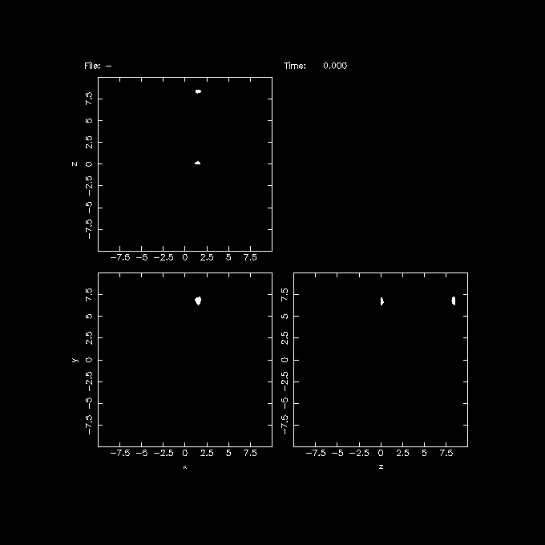
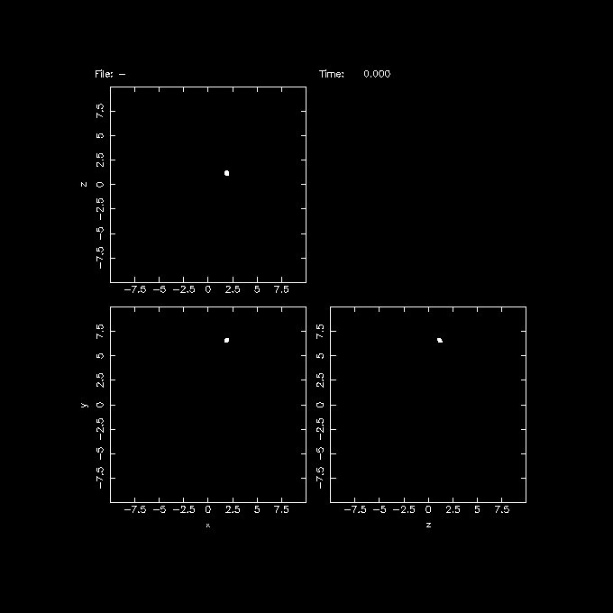
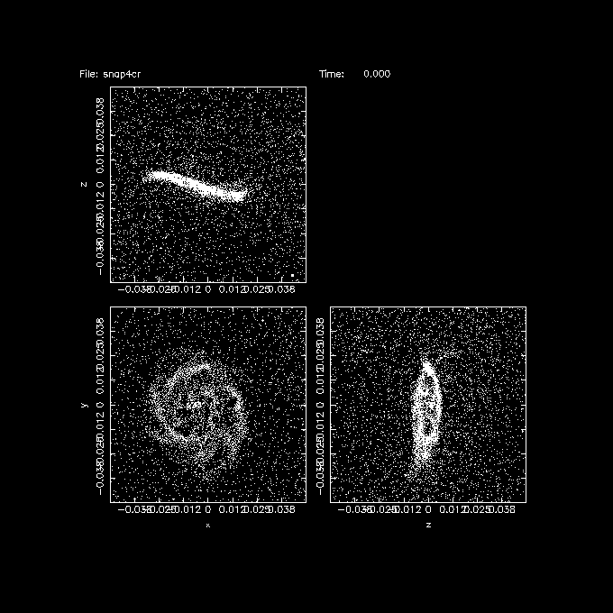
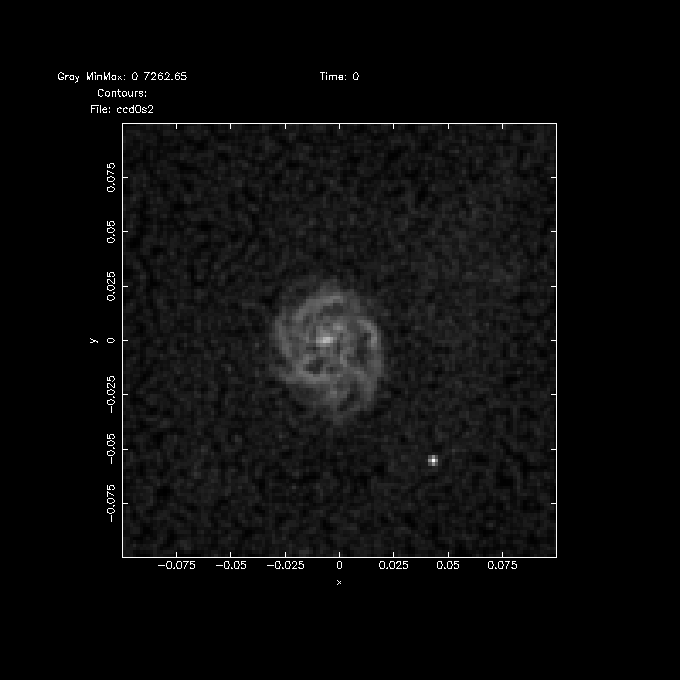
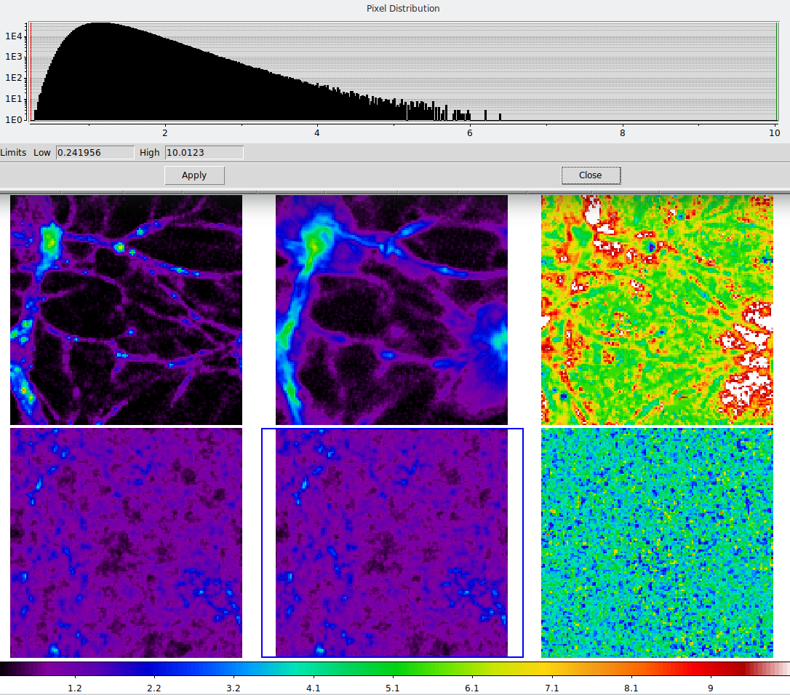

Mock observations from EAGLE simulations
========================================

.. note::  This is a sample page for ACOM

   The original is `here <https://teuben.github.io/nemo/examples/eagle.html>`_ to compare with
	   

The program eaglesnap is an alternative to the otherwise much nicer
python interfaces of martini to make mock observations of
`eagle simulation <http://icc.dur.ac.uk/Eagle/index.php>`_.
Nonetheless we will show here a few of the things one can do with
NEMO. Keep in mind that in the current version units are still
code-units, and the time is always fixed at 0.0.

If you want to play with this yourself, you will need to get an
account to download the EAGLE data, so the remainder of this page
assumes you have done that.

Getting data and initial inspection
^^^^^^^^^^^^^^^^^^^^^^^^^^^^^^^^^^^
  
First, getting at the data, with a quick look at the tools:

.. code-block:: bash
   :linenos:
   :emphasize-lines: 1,2,3,4,5,6,8,10,16
		     
    wget --user=??? --ask-password --content-disposition
      "http://dataweb.cosma.dur.ac.uk:8080/eagle-snapshots//download?run=RefL0012N0188&snapnum=28"
    wget --user=??? --ask-password --content-disposition
      "http://dataweb.cosma.dur.ac.uk:8080/eagle-snapshots//download?run=RefL0012N0188&snapnum=0"
    tar xvf RefL0012N0188_snap_028.tar 
    tar xvf RefL0012N0188_snap_000.tar
  
    h5dump RefL0012N0188/snapshot_028_z000p000/snap_028_z000p000.0.hdf5 | more
  
    eaglesnap RefL0012N0188/snapshot_028_z000p000/snap_028_z000p000.0.hdf5 snap1  ptype=0 region=2
    ### nemo Debug Info: Region: 0,2 0,2 0,2
    ### nemo Debug Info: Found 97418 particles of type 0
    ### nemo Debug Info: GroupNumber: 82 - 4064
    ### nemo Debug Info: Writing 97418 particles (group -1, subgroup -1)

    tsf snap1 
    char History[106] "eaglesnap RefL0012N0188/snapshot_028_z000p000/snap_028_z000p000.0.hdf5 snap1 ptype=0 region=2 VERSION=0.5"
    set SnapShot
    set Parameters
      int Nobj 97418 
      double Time 0.00000 
    tes
    set Particles
      int CoordSystem 66306 
      double Mass[97418] 0.000122525 0.000122525 0.000122525 0.000122525 0.000122525 0.000122525 0.000122525 0.000122525 0.000122525 
        0.000122525 0.000122525 0.000122525 0.000122525 0.000122525 0.000122525 0.000122525 0.000122525 0.000122525 0.000122525 0.000122525 
        0.000122525 0.000122525 0.000122525 0.000122525 0.000122525 0.000122525 0.000122525 0.000122525 0.000122735 0.000122525 0.000122525 
        0.000122525 0.000122525 0.000122525 0.000122525 0.000122525 0.000122525 0.000122525 0.000122525 0.000122525 0.000122525 0.000122525 
        . . .
      double PhaseSpace[97418][2][3] 0.105699 0.110451 0.0599183 48.6903 47.3848 -11.4336 0.105796 0.0433156 0.00545288 36.9015 40.5002 
        -14.4235 0.0731210 0.0403979 0.0853803 15.6860 39.7792 -7.38430 0.127888 0.113369 0.128862 30.6164 64.7130 -3.80271 0.0281841 0.112213 
        0.232397 7.04478 71.5050 7.75067 0.103734 0.0971262 0.228682 14.7581 74.5385 -6.10375 0.129609 0.0309282 0.208724 -0.576880 70.5228 
        -12.0157 0.228777 0.0722076 0.147447 19.3806 67.5598 4.41063 0.210431 0.0381443 0.235125 2.01781 62.2223 -12.8504 0.209561 0.0204466 
        . . .
      tes
    tes

The ptype=0 refers to the gas, the region=0 will extract a small cube
from 0 to 2 in both X,Y and Z. Only 97418 particles are
extracted. Also note that version 0.5 of eaglesnap was used to extract
this data, with all of its (units) shortcomings.

Looking at groups
^^^^^^^^^^^^^^^^^

Data are taken from a typical co-moving cosmological grid. Merger trees can show
groups of particles, which can be identified with galaxies. Groups
near the edge may seem to wind up in two places, as can be seen in
the following example:

.. code-block::   bash
   :linenos:
   :emphasize-lines: 1,2
   
    eaglesnap RefL0012N0188/snapshot_028_z000p000/snap_028_z000p000.0.hdf5 - 0 group=2 |\
       snapplot3 - xrange=-10:10 yrange=-10:10 zrange=-10:10

..  <!-- yapp=eagle_1.png/png -->
 

   And here is the first figure.

so we get a rough idea where this group is. We repeat this for group
4, since it's the one used in the
`example martini_eagle notebook
<https://nbviewer.jupyter.org/github/kyleaoman/martini/blob/master/examples/martini_eagle.ipynb>`_
(called fof=4 there):

.. code-block:: bash
   :linenos:
   :emphasize-lines: 1,2
   
   
    eaglesnap RefL0012N0188/snapshot_028_z000p000/snap_028_z000p000.0.hdf5 - 0 group=4 |\
        snapplot3 - xrange=-10:10 yrange=-10:10 zrange=-10:10

..    <!-- yapp=eagle_2.png/png -->

      
noting the rough coordinates of the center of this group, we
then use a common trick to weigh by potential to a large power to center and rectify
this group:

.. code-block::  bash
   :linenos:
   :emphasize-lines: 1,2,3,4,6,7
   
   
    eaglesnap snap_028_z000p000.0.hdf5 - 0 group=4 center=1.9,6.6,1.2 boxsize=8.47125 |\
        hackforce - - |\
        snapcenter - - '-phi*phi*phi' |\
        snaprect - snap4cr '-phi*phi*phi'

    s=0.05
    snapplot3 snap4cr xrange=-$s:$s yrange=-$s:$s zrange=-$s:$s 

..    <!-- yapp=eagle_3.png/png -->

  
As can be seen from the side views, it wasn't so sucessfull. Also note
a large number of gas particles in a halo type formation are visible.
We are setting the plotting box size a bit bigger, to show a
surprising (?) companion:

.. code-block:: bash
   :linenos:
   :emphasize-lines: 1,2,3,4,5
      
    s=0.1
    snapgrid snap4cr ccd0s xrange=-$s:$s yrange=-$s:$s nx=128 ny=128 mom=0  svar=0.001
    snapgrid snap4cr ccd1s xrange=-$s:$s yrange=-$s:$s nx=128 ny=128 mom=-1 svar=0.001
    ccdplot ccd0s power=0.5
    ccdplot ccd1s

..    <!-- yapp=eagle_5.png/png -->

Again note the presence of the "halo" gas across the image, which will
be confusing when making a velocity field or looking at the velocity
dispersion. Those particles will need to be taken out. A companion is
also clearly visible.

Improved viewing angles
^^^^^^^^^^^^^^^^^^^^^^^

There are two problems with the gas distribution: there is a halo, and the spiral structure makes the
disk a bit asymmetric. The disk is also warped.
  
  
Comparing GAS and DM cubes
^^^^^^^^^^^^^^^^^^^^^^^^^^

Here we take the X-Y-Z cube and look at a smoothed density field of
the gas (baryons) and dark matter and compare them. We do this at
z=0 and z=20, the two extreme times.

.. code-block:: bash
   :linenos:
   :emphasize-lines: 1,2,4,5,6,8,9,10,12,13,14,16,17,18,21,23,25,29,35,36,38,42
   
    b=8.47125      # box size
    dm=4365.77     # cheat to get the correct DM amount

    eaglesnap snapshot_028_z000p000/snap_028_z000p000.0.hdf5 - 0 |\
        snapgridsmooth - -  xrange=0:$b yrange=0:$b zrange=0:$b nx=128 ny=128 nz=128 periodic=t |\
        ccdsmooth - gas0s 0.1 dir=xyz
  
    eaglesnap snapshot_028_z000p000/snap_028_z000p000.0.hdf5 - 1 dm=$dm |\
        snapgridsmooth - -  xrange=0:$b yrange=0:$b zrange=0:$b nx=128 ny=128 nz=128 periodic=t |\
        ccdsmooth - dm0s 0.1 dir=xyz

    eaglesnap snapshot_000_z020p000/snap_000_z020p000.0.hdf5 - 0 |\
        snapgridsmooth - -  xrange=0:$b yrange=0:$b zrange=0:$b nx=128 ny=128 nz=128 periodic=t |\
        ccdsmooth - gas20s 0.1 dir=xyz

    eaglesnap snapshot_000_z020p000/snap_000_z020p000.0.hdf5 - 1 dm=$dm |\
        snapgridsmooth - -  xrange=0:$b yrange=0:$b zrange=0:$b nx=128 ny=128 nz=128 periodic=t |\
        ccdsmooth - dm20s 0.1 dir=xyz

    # compute masses
    ccdstat gas0s
    -> Sum and Sum*Dx*Dy*Dz*  : 2706454.922333 784.536918
    ccdstat dm0s
    -> Sum and Sum*Dx*Dy*Dz*  : 14849409.591463 4304.490697
    ccdstat gas20s
    -> Min and Max            : 0.241956 10.012325
    -> Mean and dispersion    : 1.327166 0.430398
    -> Sum and Sum*Dx*Dy*Dz*  : 2783269.386730 806.803604
    ccdstat dm20s
    -> Min and Max            : 1.507509 54.906773
    -> Mean and dispersion    : 7.116934 2.306722
    -> Sum and Sum*Dx*Dy*Dz*  : 14925292.575197 4326.487370
    
    # compute local Baryonic Fraction  
    ccdmath gas20s,dm20s bf20 %1/%2
    ccdmath gas0s,dm0s   bf0  %1/%2
    
    ccdstat bf20
    -> Min and Max            : 0.092280 0.339595
    -> Mean and dispersion    : 0.187254 0.017474
    
    ccdstat bf0
    -> Min and Max            : 0.000000 10459.553627
    -> Mean and dispersion    : 0.937404 13.933238

And this results in the following figure:	  

Plotting and comparing some slices through these cubes. Shown is z-slice 5,
from top-left to bottom-right are:   DM density, gas density, baryon fraction at z=0,
DM density, gas density and baryon fraction at z=20. Note that along the structures
the baryon fraction is 5-15%, but on either side can increase quite significantly
due to what looks like highler collapse factors in the DM. The histogram is that of
the gas at z=20.

References
----------

- `EAGLE simulations <http://icc.dur.ac.uk/Eagle/index.php>`_.
- MILLENIUM simulations
- `martini <https://kyleaoman.github.io/martini/build/html/index.html>`_
- `eaglesnap <https://teuben.github.io/nemo/man_html/eaglesnap.1.html>`_

.. note:: This is the end note.

   We could give you a lot of tips here. But you can also go :ref:`tips`  (somehow this link isn't working yet)
